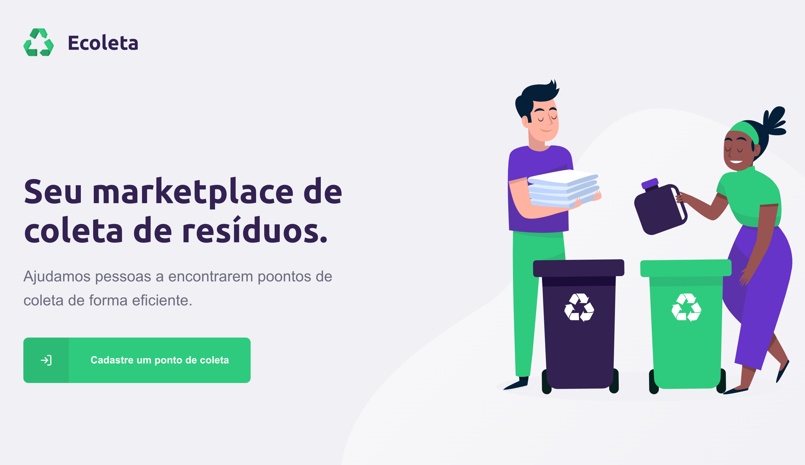

# Front end E-Coleta


## Description of the project
This is a project made based on [Rocketseat](https://rocketseat.com.br/) videos, it is a fictional project, in this project you can register collection points for recycling products.
This project has a **TS** [back-end](https://github.com/ademarCardoso/back-ecoleta), you can access it here, and it also has a [mobile](https://github.com/ademarCardoso/mobile-ecoleta/) version.

The design of the project is [here.](https://www.figma.com/file/1SxgOMojOB2zYT0Mdk28lB/Ecoleta)

## How to run
To run this project, just clone this repo and run the commands below:

```bash
git clone https://github.com/ademarCardoso/front-ecoleta.git
```
And then, run the project:
```bash
npm run start
```
This project runs at the `http://localhost:3000/`
